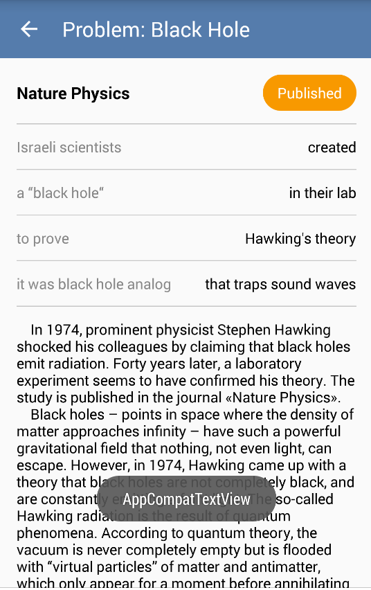
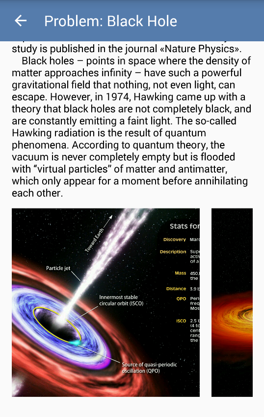

# Yalantis Android Internship Project
* Client-Server Application with a Model View Presenter (MVP) Architecture, Realm database, Retrofit and RxJava.

   

## Requirements
* Technical specifications from Yalantis:
  * [Part 1.](https://docs.google.com/document/d/18RxR5RATSfPbt8u0vGe7GT3tm4ACrcdbMYssNg2ybu0/edit)
  * [Part 2.](https://docs.google.com/document/d/11cYnqY-iQwpGCLoYn3PxEzxRYv9qr7Sm28M0Vi5xNTc/edit)
  * [Part 3.](https://docs.google.com/document/d/1_Mn-yp1MnwWKoNtEHFv8K3l-TMZLrZHdPF4k024XJKY/edit)
* The app should store data in a database of your choice: realm, native SQL, or sqlbrite.
* Facebook login. The app should save profile into the database and save access_token. 
* Profile page with a user name and photo.
* MVP architecture.
* API to get data: http://dev-contact.yalantis.com/rest/v1/tickets	
* Minimal SDK version = 16.
* No hardcoded values, use styles.
* App should conform to [google coding style](https://source.android.com/source/code-style.html).
* Only portrait orientation.

## Extra fun stuff added:
* Yalantis star wars animation (https://github.com/Yalantis/StarWars.Android)
* star wars theme as background sound
